<div align="center">

# Health Monitoring and Alert System

### End-to-End IoT Health Monitoring and Alert System for Elderly Care

[](https://www.espressif.com/)
[](https://firebase.google.com/)
[](https://web.dev/progressive-web-apps/)
[](LICENSE)
[]()

</div>

**A full-stack IoT system that monitors Heart Rate, SpO2, Blood Pressure & GPS location in real-time, streams data to the cloud, and surfaces it through a responsive Web Portal and Android App.**

<div align="center">
<table>
  <tr>
    <td align="center">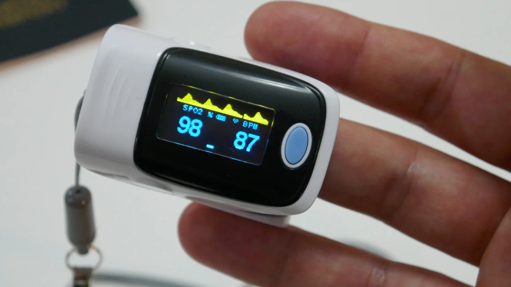<br/><b>Heart Rate Measurement</b></td>
    <td align="center">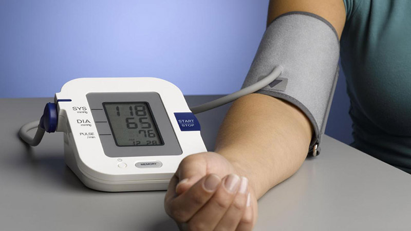<br/><b>Blood Pressure Measurement</b></td>
  </tr>
</table>

</div>

---

## Table of Contents
- [Overview](#overview)
- [System Architecture](#system-architecture)
- [Key Features](#key-features)
- [Technology Stack](#technology-stack)
- [Hardware Design](#hardware-design)
- [Firmware](#firmware)
- [Web Portal](#web-portal)
- [Screenshots](#screenshots)
- [Project Structure](#project-structure)
- [Getting Started](#getting-started)

---

## Overview

**Health Guardian** is a graduation thesis project built for **remote health monitoring of elderly patients**. It combines custom embedded hardware, real-time cloud synchronization, and a cross-platform user interface to give caregivers and medical staff instant visibility into a patient's vital signs — from anywhere, at any time.

The system spans three tightly integrated layers:

| Layer | Role |
|-------|------|
| **Embedded Device** | Collects vitals & GPS, displays data locally on TFT, syncs to cloud via Wi-Fi / 4G LTE |
| **Firebase Cloud** | Acts as real-time database, authentication provider, and hosting platform |
| **Web Portal / Android App** | Dashboard for caregivers to monitor, receive alerts, and review history |

---

## System Architecture

```
┌──────────────────────────────────────────────────────────────────┐
│                        EMBEDDED DEVICE                           │
│  ┌──────────┐  ┌────────────┐  ┌──────────┐  ┌──────────────┐    │
│  │ MAX30102 │  │  SIM A7682S│  │ ATGM366H │  │  INA219      │    │
│  │ HR/SpO2  │  │  4G LTE    │  │  GPS     │  │  Battery     │    │
│  └────┬─────┘  └─────┬──────┘  └────┬─────┘  └──────┬───────┘    │
│       │              │              │                │           │
│  ┌────▼──────────────▼──────────────▼────────────────▼───────┐   │
│  │                   ESP32 (Main MCU)                        │   │
│  │   LVGL + TFT_eSPI │ TinyGPSPlus │ Firebase_ESP_Client     │   │
│  │   Guest / User / Dashboard UI modes                       │   │
│  └───────────────────────────┬───────────────────────────────┘   │
│                              │ Wi-Fi / SIM                       │
└──────────────────────────────│───────────────────────────────────┘
                               │
                    ┌──────────▼───────────┐
                    │  Firebase Platform   │
                    │  ├─ Realtime DB      │
                    │  ├─ Authentication   │
                    │  └─ Hosting          │
                    └──────────┬───────────┘
                               │
              ┌────────────────┼────────────────┐
              │                │                │
      ┌───────▼──────┐ ┌───────▼──────┐ ┌──────▼───────┐
      │  Web Portal  │ │ Android App  │ │  Any Browser │
      │  (PWA)       │ │  (APK/AAB)   │ │  (Real-time) │
      └──────────────┘ └──────────────┘ └──────────────┘
```

---

## Key Features

### Real-Time Dashboard
- Live Heart Rate, SpO2, Blood Pressure readings updated via Firebase snapshot listeners
- Device health cards: battery level (INA219), last-seen timestamp, network status
- Color-coded severity badges: **Normal / Warning / Danger**

### GPS Location Tracking
- BDS ATGM336H GPS module streams coordinates every 5 seconds
- Interactive map using **Leaflet + OpenStreetMap** (100% free, no API key needed)
- Last-known location retained for emergency scenarios

### Alert 
- Auto-generates alerts when vitals exceed configurable thresholds (HR, SpO2, BP)
- Severity classification: **warning / danger**
- Filter by type, severity, and acknowledgment status
- One-click acknowledgment with timestamp; deep-link from alert to the exact history timestamp

### History & Data Export
- Query historical measurements by custom date/time range
- Interactive **Chart.js** line charts with multi-metric overlay
- Summary statistics (min, max, average) per session
- **CSV export** for offline analysis or medical records

### Multi-Patient Management
- One caregiver account manages multiple patients & devices
- Device binding via unique **Device ID** with pairing code
- Firebase Security Rules enforce per-user data isolation

### Progressive Web App (PWA)
- Installable on desktop and mobile (fullscreen mode)
- **Service Worker** with network-first navigation + cache-first static asset strategy
- Graceful offline experience with cached shell

### Authentication
- Firebase Auth with **Email/Password** and **Google OAuth (SSO)**
- Session persistence; synthetic username-to-email mapping for simple login UX

---

## Technology Stack

### Hardware
| Component | Role |
|-----------|------|
| **ESP32** | Main MCU — dual-core 240 MHz, Wi-Fi + BT |
| **MAX30102** | Heart Rate & SpO2 (I2C) |
| **A7682S** | 4G LTE SIM module — cellular fallback connectivity |
| **BDS ATGM336H** | GPS positioning (UART) |
| **DS3231** | Real-Time Clock (I2C) |
| **INA219** | Battery voltage & current monitor (I2C) |
| **ST7796S TFT 4"** | 480x320 SPI display |
| **FT6336U** | Capacitive touchscreen controller (I2C) |
| **DFPlayer Mini** | MP3 audio alerts |
| **TP4056 + XL6009** | LiPo charge management + DC-DC boost |

### Firmware (Embedded C++)
| Technology | Usage |
|------------|-------|
| **Arduino / ESP-IDF** | Core framework for ESP32 |
| **LVGL** | Embedded GUI framework for TFT UI |
| **TFT_eSPI** | High-performance TFT driver |
| **Firebase_ESP_Client** | Cloud sync to Firebase Realtime DB |
| **TinyGPSPlus** | NMEA GPS sentence parsing |
| **Adafruit INA219** | Power monitoring library |
| **RTClib** | DS3231 RTC driver |
| **DFRobotDFPlayerMini** | MP3 player control |
| **Preferences (NVS)** | Persistent storage on ESP32 flash |

### Web / Cloud
| Technology | Usage |
|------------|-------|
| **HTML5 / CSS3 / JavaScript (ES6)** | Vanilla modular frontend (no framework bloat) |
| **Bootstrap 5** | Responsive layout and UI components |
| **Chart.js 4** | Interactive time-series charts |
| **Leaflet 1.9 + OpenStreetMap** | GPS map visualization |
| **Firebase Auth** | Google OAuth + Email/Password authentication |
| **Firebase Realtime DB** | Real-time data sync with snapshot listeners |
| **Firebase Hosting** | CDN-backed static hosting with custom caching rules |
| **Service Worker + Cache API** | Offline-capable PWA |
| **Web Crypto API** | Cryptographically secure ID generation |

### Tools & Design
| Tool | Usage |
|------|-------|
| **Altium Designer** | PCB layout & schematic capture |
| **PWA Builder** | Android app (APK/AAB) |
| **Git + GitHub** | Version control |

---

## Hardware Design

The device is built on a **custom-designed PCB** integrating all modules into a compact form factor.

**PCB Layout & Schematic**

<table>
  <tr>
    <td align="center">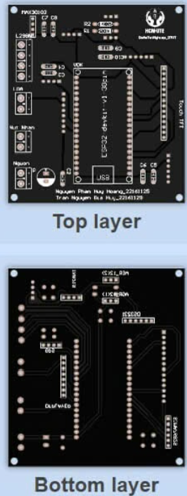<br/><b>PCB Layout</b></td>
    <td align="center">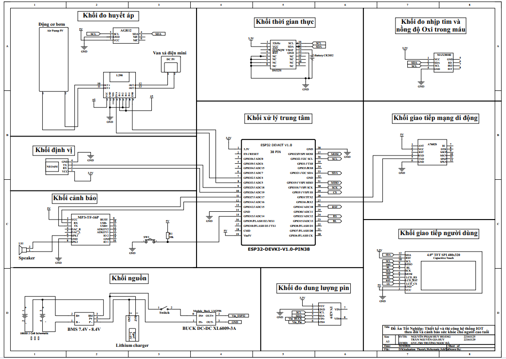<br/><b>Schematic</b></td>
  </tr>
</table>

**Device**

<table>
  <tr>
    <td align="center">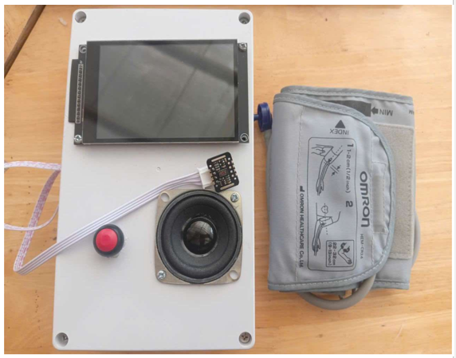<br/><b>Device</b></td>
    <td align="center">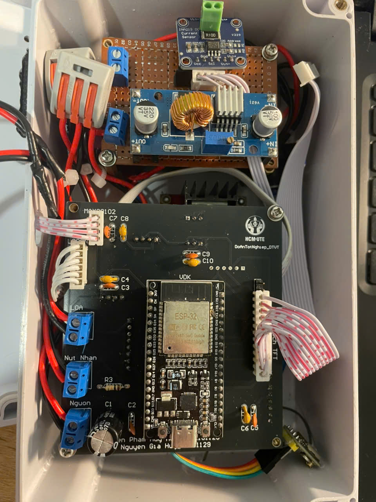<br/><b>Inside View</b></td>
  </tr>
</table>

Design files available in `/PCB/` and `/Schematic/`, along with all component datasheets in `/Documents/`.

---

## Firmware

The firmware is structured into modular C++ classes:

```
Firmware/Main_Gui/
├── Main_Gui.ino        # Entry point — setup(), loop(), peripheral init
├── MainUi.cpp/h        # LVGL screen management & navigation
├── GuestMode.cpp/h     # UI for unauthenticated state
├── UserMode.cpp/h      # Login flow & user session
├── UserDashboard.cpp/h # Live vitals display for authenticated user
├── FirebaseSync.cpp/h  # Firebase RTDB read/write, device registration
├── HR_SPO2_BP.cpp/h    # Sensor acquisition, signal processing
├── sim_module.cpp/h    # A7682S 4G LTE AT-command driver
├── keypad.cpp/h        # Touchscreen keypad input
└── wifi_icon / monitoring_icon # LVGL custom image assets (.c)
```

**Operating modes:**
- **Guest Mode** — device unregistered, shows splash + QR-style Device ID for pairing
- **User Mode** — login prompt, credential entry via touch keypad
- **User Dashboard** — live vitals, GPS, battery, alert sounds via DFPlayer Mini

---

## Web Portal

Deployed on **Firebase Hosting** as a **PWA**:

**[Live Demo](https://graduation-thesis-3a3df.web.app)**

```
WEB/
├── index.html              # Single-page shell (Bootstrap 5)
├── style.css               # Custom responsive styles
├── app.js                  # Firebase init, auth, device claiming, core logic
├── modules.state.js        # Shared reactive state
├── modules.selectors.js    # DOM query helpers
├── modules.patients.js     # Patient CRUD + device binding
├── modules.history.js      # Time-range queries, Chart.js, CSV export
├── modules.alerts.js       # Real-time alerts, filtering, acknowledgment
├── modules.settings.js     # User settings & threshold configuration
├── service-worker.js       # PWA caching strategy (network-first + cache-first)
└── manifest.json           # PWA metadata (fullscreen, icons, theme color)
```

**Dashboard Tabs:**
| Tab | Features |
|-----|----------|
| **Overview** | Live HR / SpO2 / BP cards, device status, mini 1h chart, GPS map |
| **History** | Date-range picker, Chart.js multi-metric chart, data table, CSV export |
| **Alerts** | Filterable alert list (type / severity / status), acknowledge, deep-link to timestamp |
| **Patients / Devices** | Add, view, delete patients; bind device by ID + pairing code |
| **Settings** | Alert thresholds, user preferences |

---

## Screenshots

<table>
  <tr>
    <td align="center">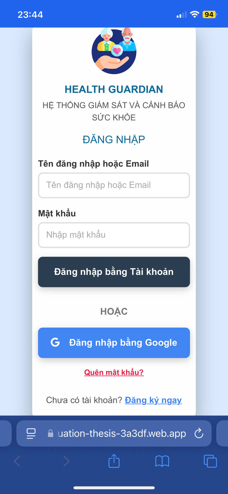<br/><b>Login Screen</b></td>
    <td align="center">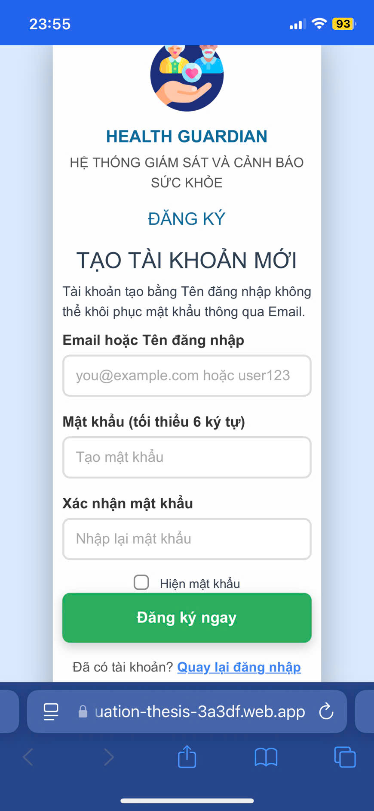<br/><b>Register</b></td>
  </tr>
  <tr>
	<td align="center">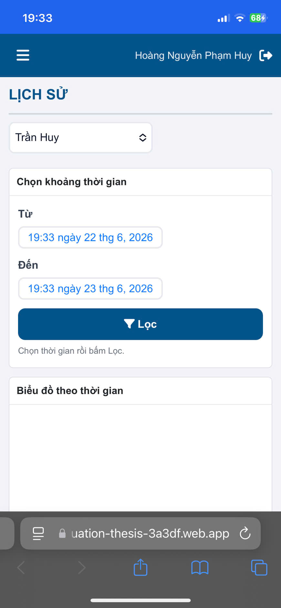<br/><b>History & Charts</b></td>
    <td align="center">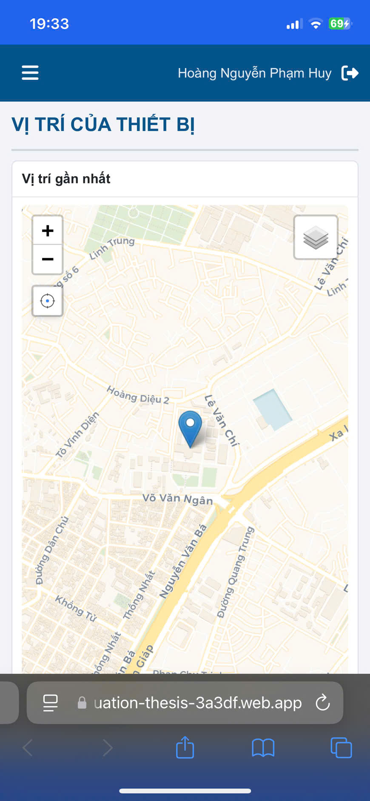<br/><b>GPS Location Map</b></td>
  </tr>
  <tr>
	<td align="center">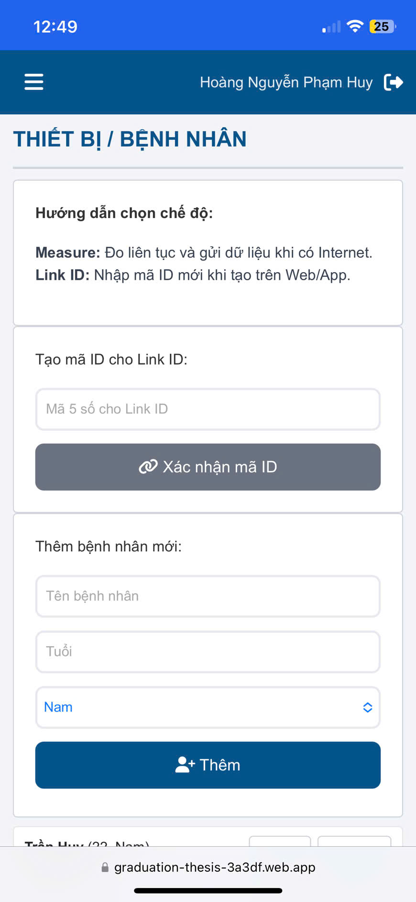<br/><b>Patient Management</b></td>
    <td align="center">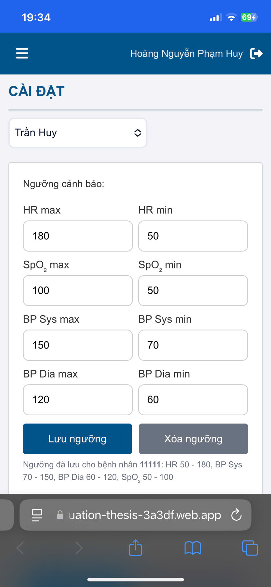<br/><b>Settings</b></td>
  </tr>
</table>


| App Screenshot | Web Portal |
|:-:|:-:|
| 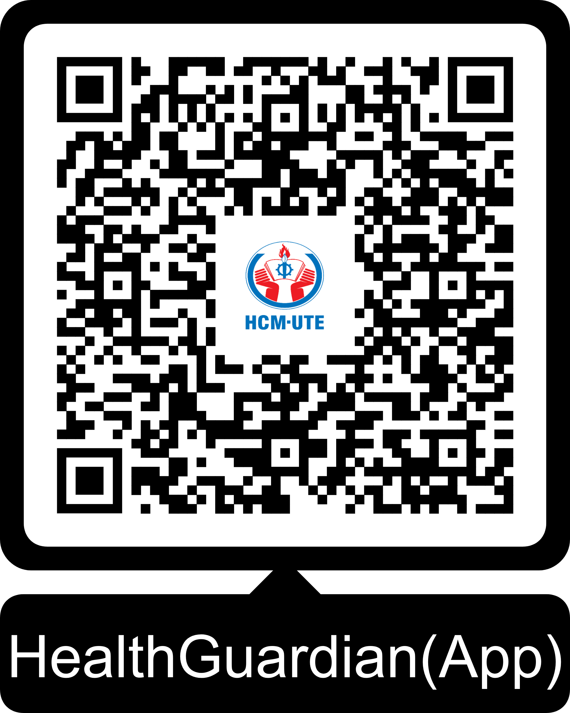 |  |

**Device Screen (Embedded TFT)**

<table>
  <tr>
    <td align="center">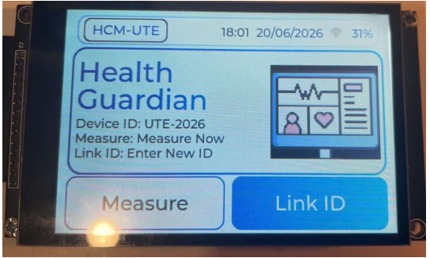<br/><b>Main Dashboard</b></td>
    <td align="center">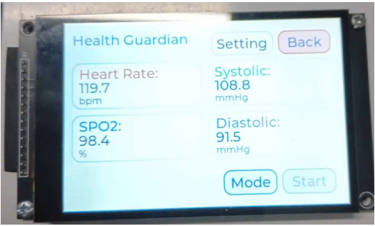<br/><b>Parameters Screen</b></td>
    <td align="center">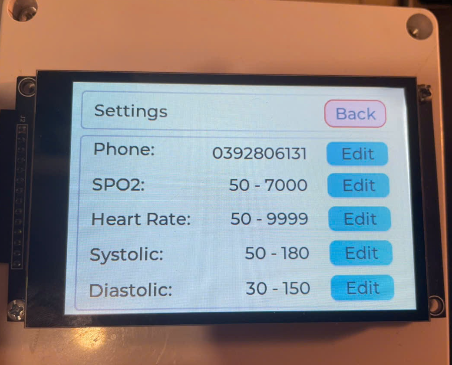<br/><b>Settings Screen</b></td>
  </tr>
</table>

---

## Project Structure

```
Graduation_Thesis/
├── Firmware/               # ESP32 embedded firmware (C++/Arduino)
│   ├── Main_Gui/           # Main application with LVGL UI & Firebase sync
│   ├── HR_SPO2_BP/         # Standalone sensor test sketch
│   ├── LCD_TFT_TOUCH/      # TFT + touch driver experiments
│   └── ModuleSim/          # A7682S SIM module AT-command test
├── WEB/                    # Web portal (PWA — HTML/CSS/JS + Firebase)
├── APP/                    # Android app (APK + AAB release)
├── PCB/                    # Altium Designer PCB layout files
├── Schematic/              # Altium Designer schematic files
├── Documents/              # Component datasheets (ESP32, BDS ATGM336H, DS3231, etc.)
├── Test/                   # Sensor integration test scripts
├── assets/                 # Images for README / documentation
├── firebase.json           # Firebase Hosting configuration
└── README.md
```

---

## Getting Started

### Web Portal (Local Dev)
```bash
git clone https://github.com/huyhoang-1501/Graduation_Thesis.git
cd Graduation_Thesis

# No build step needed — pure HTML/JS
# Open WEB/index.html in a browser, or serve with:
npx serve WEB

# Deploy to Firebase Hosting
firebase deploy
```

### Firmware (ESP32)
1. Install **Arduino IDE** (>= 2.x) with **ESP32 board package**
2. Install required libraries via Library Manager:
   - `TFT_eSPI`, `lvgl`, `TinyGPSPlus`, `Firebase_ESP_Client`
   - `Adafruit INA219`, `RTClib`, `DFRobotDFPlayerMini`
3. Open `Firmware/Main_Gui/Main_Gui.ino`
4. Configure `FirebaseSync.h` with your Firebase project credentials
5. Select board **ESP32 Dev Module**, compile and upload

---

## License

This project is licensed under the **MIT License** — see [LICENSE](LICENSE) for details.

---

<div align="center">
**Built as a Graduation Thesis — HCM-UTE 2026**
</div>